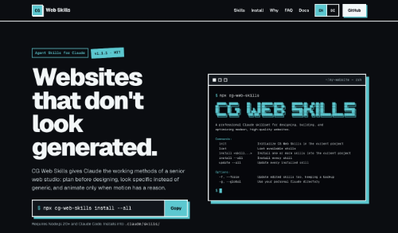

# CG Web Skills

Professional web design, motion, SEO, GEO, and accessibility expertise for Claude, packaged as installable Agent Skills.

[](LICENSE)

**Website:** [cg-web-skills-website.vercel.app](https://cg-web-skills-website.vercel.app/en)

CG Web Skills gives Claude the working methods of a senior web studio: how to plan a website before designing it, how to make it look specific instead of generic, how to add motion that helps rather than distracts, how to make it findable in classic and AI-powered search, and how to make it accessible to everyone. You install the skills once, and Claude uses them automatically whenever you work on a website.

```bash
npx cg-web-skills install --all
```

That's it: this installs the complete skillset into your project. Open Claude Code in the same project and ask for what you need, for example _"Plan and build a website for my physiotherapy practice."_

---

## Contents

- [What are skills?](#what-are-skills)
- [The skillset](#the-skillset)
  - [`cg-web-designer`](#cg-web-designer)
  - [`cg-web-animate`](#cg-web-animate)
  - [`cg-web-seo`](#cg-web-seo)
  - [`cg-web-geo`](#cg-web-geo)
  - [`cg-web-accessibility`](#cg-web-accessibility)
  - [How the skills work together](#how-the-skills-work-together)
- [Quick start](#quick-start)
- [Using the skills in Claude](#using-the-skills-in-claude)
- [CLI reference](#cli-reference)
- [Installing as a Claude Code plugin](#installing-as-a-claude-code-plugin)
- [Updating and removing skills](#updating-and-removing-skills)
- [FAQ](#faq)
- [For contributors](#for-contributors)
- [License](#license)

---

## What are skills?

[Agent Skills](https://platform.claude.com/docs/en/agents-and-tools/agent-skills/overview) are folders of instructions that Claude loads on demand. Each skill has a `SKILL.md` file whose description tells Claude _when_ the skill is relevant. When your request matches, Claude reads the skill and follows it. When it doesn't, the skill stays out of the way and costs nothing.

In practice, that means you don't have to paste long prompts about accessibility, easing curves, or content strategy into every conversation. The skills bring that knowledge with them.

## The skillset

| Skill | Role | Use it for |
| ----- | ---- | ---------- |
| [`cg-web-designer`](skills/cg-web-designer/SKILL.md) | Lead web designer, UX and content strategist, frontend quality lead | Planning, designing, building, reviewing, and launching websites and landing pages |
| [`cg-web-animate`](skills/cg-web-animate/SKILL.md) | Senior design engineer and motion designer | Designing, implementing, reviewing, and optimizing animations and motion systems |
| [`cg-web-seo`](skills/cg-web-seo/SKILL.md) | SEO specialist | Technical SEO, search intent, information architecture, on-page, structured data, Core Web Vitals, audits, and relaunches |
| [`cg-web-geo`](skills/cg-web-geo/SKILL.md) | Generative Engine Optimization specialist | Making websites findable, understandable, and citable in AI search (Google AI Overviews/AI Mode, Copilot, ChatGPT Search, Perplexity) |
| [`cg-web-accessibility`](skills/cg-web-accessibility/SKILL.md) | Accessibility engineer | Fixing WCAG 2.2 AA barriers in the codebase and building a native, site-wide accessibility toolbar |

The three newer skills (`cg-web-seo`, `cg-web-geo`, `cg-web-accessibility`) are written in German. Claude applies them just as well to projects in any language.

### `cg-web-designer`

The end-to-end web design skill. It treats every request like a small studio engagement instead of jumping straight to a homepage.

**What Claude does with it**

- **Starts by reducing uncertainty.** Before any code, Claude clarifies the site's purpose, audience, primary action, content, and constraints. A vague brief like _"make it modern and premium"_ gets translated into concrete design rules, with follow-up questions where needed.
- **Works through a real process:**

  ```text
  Intake → Discovery → Strategy → Content → Information Architecture → UX/Wireframes
  → Design Direction → Design System → Visual Design → Prototype/Test → Engineering
  → QA → Launch → Iteration
  ```

- **Designs content first.** Structure and copy come before visual composition, so the layout serves the message.
- **Builds a design system.** Tokens for color, type, spacing, and components, so the site stays consistent as it grows.
- **Covers the quality basics:** responsive design, accessibility (WCAG 2.2), performance (Core Web Vitals), SEO, QA, launch checklist, and handoff.
- **Audits against "AI slop".** Claude checks the result against the generic defaults of AI-generated websites (interchangeable hero sections, decorative gradients, filler cards, and so on) and removes them.
- **Never invents facts.** Prices, testimonials, statistics, certifications, team members, and legal text are never made up. Unknowns are marked and asked for.

It also handles redesigns of existing sites and has a defined fallback when you say _"just build it"_.

**Example prompts**

- _"I need a website for my architecture firm. Where do we start?"_
- _"Redesign this landing page. It feels generic."_
- _"Review my homepage for accessibility, performance, and SEO before launch."_
- _"Create a design system for this project."_

### `cg-web-animate`

The motion skill. Its core rule: **every animation must have a reason to exist.** Claude uses motion to communicate hierarchy, spatial continuity, feedback, and brand, not as decoration added at the end.

**What Claude does with it**

- **Decides whether to animate at all**, then picks the simplest technology that does the job: CSS, Web Animations API, View Transitions, native scroll-driven animations, GSAP, Motion (Framer Motion), Lottie, Rive, SVG, Canvas, or WebGL.
- **Uses a consistent motion system:** easing rules, a timing scale, stagger, and motion tokens instead of one-off values.
- **Knows the common patterns:** hero entrances, text reveals and masks, scroll reveals and choreography, parallax, hover and micro-interactions, page transitions, loading states, skeletons, marquees, cursor effects, and SVG animation.
- **Keeps it accessible:** respects `prefers-reduced-motion` (in CSS and JavaScript), keyboard focus, and flashing-content limits.
- **Keeps it fast:** animates compositor-friendly properties, avoids unnecessary layout animation, uses `will-change` sparingly, and prevents flashes of unstyled content.
- **Follows framework rules** for React/Next.js and GSAP, including cleanup and responsive motion.
- **Reviews its own work** with a motion review process and checklist, and avoids "AI animation slop" such as fading everything in on scroll.

**Example prompts**

- _"Add a premium hero entrance to this page."_
- _"Our scroll animations feel cheap. Review and fix them."_
- _"Build a page transition between the project list and project detail in Next.js."_
- _"Make these buttons feel more responsive."_

### `cg-web-seo`

The search skill. It treats SEO as a system instead of a layer of keywords: **Discovery → Crawl → Render → Index → Relevance → Quality/Trust → Search Appearance → Click → UX/Conversion → Measurement → Iteration.**

**What Claude does with it**

- **Starts with the business and search intent.** Claude builds a topic map before a keyword map, gives every primary intent one clear target page, and avoids keyword cannibalization and thin "SEO pages".
- **Covers technical SEO end to end:** status codes, redirects, `robots.txt` vs. `noindex`, sitemaps, canonicals, `hreflang`, JavaScript rendering, mobile, and security.
- **Handles on-page and content quality:** titles, meta descriptions, headings, internal linking and anchor text, images, E-E-A-T as real trust signals, and a process against AI slop.
- **Uses structured data correctly:** JSON-LD as a connected `@graph` that matches the visible content, never as a ranking hack.
- **Knows Core Web Vitals** (LCP, INP, CLS), local and international SEO, migrations and relaunches, faceted navigation, pagination, and a Next.js SEO baseline.
- **Audits with priorities** (P0 to P3), acceptance criteria, and Search Console as a diagnostic tool.
- **Rejects SEO myths.** No keyword density, no word-count rules, no guaranteed rankings. Claims are labeled as documented guideline, best practice, heuristic, or hypothesis.

**Example prompts**

- _"Run an SEO audit of this Next.js site and prioritize the fixes."_
- _"We're relaunching. Plan the redirects and make sure we don't lose rankings."_
- _"Add structured data for our organization and services."_
- _"Build a topic map and page structure for our service pages."_

### `cg-web-geo`

The Generative Engine Optimization skill. Its core rule: **GEO is not a replacement for SEO.** Claude optimizes the whole web presence so that search and answer systems can find, understand, verify, and cite it, without chasing hacks.

**What Claude does with it**

- **Evaluates the full chain:** discoverability, indexability, retrievability, extractability, and evidence, then fixes the foundation before producing content (_Access → Index → Understand → Retrieve → Cite → Convert_).
- **Builds entity clarity:** who the organization is, what it offers, for whom, where, and since when, kept consistent on the website and external profiles.
- **Writes citation-ready content:** concrete, self-contained claims with numbers, dates, and sources, and a real _reason to cite_ (original data, experience, local expertise).
- **Configures AI crawler access deliberately,** for example `OAI-SearchBot` vs. `GPTBot`, instead of blocking or allowing every AI bot.
- **Treats `llms.txt`, schema, and "chunking" soberly.** None of them is a magic GEO switch, and Claude says so.
- **Measures instead of guessing:** Search Console, Bing AI Performance, repeated multi-platform AI query tests, and an experiment protocol, because AI answers are stochastic.
- **Avoids manipulation:** no hidden prompt injection, fake freshness, artificial mentions, or programmatic city spam.

**Example prompts**

- _"Why doesn't ChatGPT mention our company? Run a GEO audit."_
- _"Make our service pages easier for AI search to cite."_
- _"Check our robots.txt for AI crawlers. We want to appear in ChatGPT Search."_
- _"Set up a test plan to track our visibility in AI Overviews, Copilot, and Perplexity."_

### `cg-web-accessibility`

The accessibility skill. It works on two levels that always belong together: **accessibility by source, plus accessibility preferences on top.**

**What Claude does with it**

- **Fixes real barriers in the code:** semantic HTML, landmarks, headings, alt text, forms and error messages, keyboard operation, focus management, contrast, reflow, media, and status messages, audited against the WCAG 2.2 A/AA success criteria.
- **Builds a native accessibility toolbar:** a site-wide button with an accessible dialog for larger text, text spacing, line height, contrast modes, link highlighting, reduced motion, hidden images, a reading-friendly font, a larger cursor, focus highlighting, a page structure navigator, optional read-aloud, and a reset. Everything is stored locally, without external services or tracking.
- **Follows your architecture:** a central provider near the app shell, SSR-safe browser APIs, and the project's own styling system (React/Next.js, Vue/Nuxt, SvelteKit, or plain HTML/JS).
- **Verifies its work:** lint, typecheck, build, automated scans such as axe, keyboard and screen reader passes, mobile, and 200 % text size.
- **Stays honest about compliance.** The toolbar never replaces accessible source code, and Claude never claims that a widget makes a site WCAG, EN 301 549, or BFSG compliant.

**Example prompts**

- _"Make our website accessible and add an accessibility button."_
- _"Check this site against WCAG 2.2 AA and fix what you find."_
- _"Our online shop falls under the BFSG. What do we need to fix?"_
- _"The mobile menu isn't usable with a keyboard. Fix it."_

### How the skills work together

The skills are independent. Install only the ones you need, or all of them.

When several are installed, `cg-web-designer` leads the project and hands the specialist work to the others: `cg-web-animate` supplies the motion craft, `cg-web-seo` the search foundation, `cg-web-geo` the AI search perspective on top of it, and `cg-web-accessibility` the WCAG remediation and the accessibility toolbar. You don't need to call them explicitly; Claude picks whichever fits the task.

---

## Quick start

**Requirements:** Node.js 20 or later, and [Claude Code](https://code.claude.com/docs) (or another environment that supports Agent Skills).

1. **Go to your project.**

   ```bash
   cd my-website
   ```

2. **See which skills are available.**

   ```bash
   npx cg-web-skills list
   ```

3. **Install the skills.** Install the complete skillset:

   ```bash
   npx cg-web-skills install --all
   ```

   Or pick individual skills:

   ```bash
   npx cg-web-skills install cg-web-designer
   npx cg-web-skills install cg-web-designer cg-web-animate
   npx cg-web-skills install cg-web-seo cg-web-geo cg-web-accessibility
   ```

   The skills are copied to `.claude/skills/` in your project. Commit that folder to share the skills with your team.

4. **Start Claude Code in the project and describe what you want.**

Prefer to have the skills in every project? Install them globally instead:

```bash
npx cg-web-skills install --all --global
```

## Using the skills in Claude

**Automatically.** Just describe your task. Claude matches it against each skill's description and loads the skill when it fits. Asking for a website, a redesign, a landing page review, a hover effect, a scroll animation, an SEO audit, AI search visibility, or an accessibility fix is enough.

**Explicitly.** In Claude Code, skills are also available as slash commands. Type `/cg-web-designer`, `/cg-web-animate`, `/cg-web-seo`, `/cg-web-geo`, or `/cg-web-accessibility` to invoke one directly, or simply mention the skill by name in your prompt.

**Checking that it works.** Ask Claude _"Which skills do you have available?"_ in the project. The installed CG Web Skills should be listed.

---

## CLI reference

The CLI is a small, dependency-free Node.js tool. Its job is to copy skill folders into the right place, so Claude can find them, and to keep them up to date.

You can run it without installing anything:

```bash
npx cg-web-skills <command>
```

Or install it globally and call it directly:

```bash
npm install --global cg-web-skills
cg-web-skills <command>
```

### Commands

| Command / option  | Description |
| ----------------- | ----------- |
| `list`            | Lists every skill shipped in the package, with a short description. |
| `install <skill...>` | Copies each named skill from `skills/<skill>/` into `.claude/skills/<skill>/` in the current project. Creates `.claude/skills/` if needed. If any name is unknown, nothing is installed. |
| `install --all`   | Installs every skill in the skillset. Skills that are already installed are skipped, so you can re-run it after an update to add new skills. |
| `update <skill...>` | Replaces the named installed skills with the version in this package. Skills with local changes are left alone unless you add `--force`. |
| `update --all`    | Updates every installed CG Web Skill. Skills that are not installed are left alone. |
| `init`            | Creates `.claude/skills/` in the current project without installing anything. Optional, and safe to re-run. |
| `help`            | Shows help. |
| `-a, --all`       | For `install` and `update`: every skill. |
| `-f, --force`     | For `update`: also update skills with local changes. The current version is backed up first. |
| `-g, --global`    | For `install`, `update`, and `init`: use your personal Claude directory instead of the project. |
| `-v, --version`   | Shows the version. |
| `-h, --help`      | Shows help. |

Running `cg-web-skills` without a command (or with `--help`) shows the help. In a terminal at least 94 columns wide it opens with the CG Web Skills banner; in narrower terminals and when the output is piped, it prints a plain title instead.

### Where skills are installed

| Scope | Directory | Available in |
| ----- | --------- | ------------ |
| Project (default) | `<project>/.claude/skills/<skill>/` | This project only. Can be committed and shared with your team. |
| Personal (`--global`) | `~/.claude/skills/<skill>/` | All your projects. |

With `--global`, the personal Claude directory is `$CLAUDE_CONFIG_DIR` when that variable is set, otherwise `~/.claude`.

### What a session looks like

```console
$ npx cg-web-skills list
Available skills:

  cg-web-accessibility  Implementiert und remediatiert Website-Barrierefreiheit direkt im bestehenden Codebase. Erstellt ei…
  cg-web-animate        Expert skill for designing, implementing, reviewing, and optimizing premium web animations and moti…
  cg-web-designer       Lead web designer, UX strategist, content strategist, and frontend quality lead for professional we…
  cg-web-geo            Vollumfänglicher Claude Skill für Generative Engine Optimization (GEO) von Websites. Analysiert und…
  cg-web-seo            Vollumfänglicher SEO-Skill für professionelle Websites. Verwende ihn bei Website-Planung, Relaunche…

Install a skill with `cg-web-skills install <skill>`, or all of them with `--all`.

$ npx cg-web-skills install --all
✔ Installed cg-web-accessibility to .claude/skills/cg-web-accessibility
✔ Installed cg-web-animate to .claude/skills/cg-web-animate
✔ Installed cg-web-designer to .claude/skills/cg-web-designer
✔ Installed cg-web-geo to .claude/skills/cg-web-geo
✔ Installed cg-web-seo to .claude/skills/cg-web-seo

$ npx cg-web-skills install --all
- Skipped cg-web-accessibility: already installed at .claude/skills/cg-web-accessibility
- Skipped cg-web-animate: already installed at .claude/skills/cg-web-animate
- Skipped cg-web-designer: already installed at .claude/skills/cg-web-designer
- Skipped cg-web-geo: already installed at .claude/skills/cg-web-geo
- Skipped cg-web-seo: already installed at .claude/skills/cg-web-seo

$ npx cg-web-skills@latest update --all
✔ Updated cg-web-animate (1.1.0 → 1.2.0)
- cg-web-designer is already up to date

$ npx cg-web-skills install cg-web-designer
✖ Skill "cg-web-designer" is already installed at .claude/skills/cg-web-designer

Remove the existing directory first if you want to reinstall it.
```

### Safety

- The CLI only copies files. Skill contents are treated as data and are never executed or modified.
- `install` never overwrites an existing installation. `update` replaces a skill only when it has no local changes, or with `--force` after moving the current version to a backup. The new version is copied first and swapped in afterwards, so a failed update never leaves a half-copied skill.
- Skill names must be lowercase kebab-case. Anything else, including `..`, path separators, and absolute paths, is rejected, so a name can never write outside the skills directory.
- Skills containing symlinks or other special files are refused.

### Exit codes

| Code | Meaning |
| ---- | ------- |
| `0`  | Success |
| `1`  | General error (for example: skill not found, already installed) |
| `2`  | Invalid usage (for example: unknown command or option, missing or invalid skill name) |

---

## Installing as a Claude Code plugin

The repository is also a Claude Code plugin (see [`.claude-plugin/plugin.json`](.claude-plugin/plugin.json)). Instead of copying individual skills, you can load all of them at once:

```bash
git clone https://github.com/CGWebDev2003/cg-web-skills.git
claude --plugin-dir ./cg-web-skills
```

Claude Code discovers every skill in the plugin's `skills/` directory. New skills appear automatically after you pull the latest version.

## Updating and removing skills

### Update

Update every installed skill to the latest version:

```bash
npx cg-web-skills@latest update --all
```

Or update individual skills with `npx cg-web-skills@latest update cg-web-designer`. Use `@latest`, otherwise `npx` may run an older cached version of the CLI.

`update` protects your own edits:

- When you install a skill, the CLI records a fingerprint of it in `.claude/cg-web-skills.json`.
- On `update`, a skill that still matches its fingerprint is replaced with the new version.
- A skill you edited is **not** changed. The CLI tells you which skills have local changes and stops. Run the command again with `--force` to update them anyway; the edited version is moved to `.claude/cg-web-skills-backups/` first, so you can copy your changes over.
- Skills installed before version 1.1.0, or copied by hand, have no fingerprint. If they differ from the new version, they need `--force` once, since the CLI cannot tell your edits from an older version.

You can commit `.claude/cg-web-skills.json` together with `.claude/skills/`. You probably want to add `.claude/cg-web-skills-backups/` to your `.gitignore`.

### Add new skills

```bash
npx cg-web-skills@latest install --all
```

Skills you already have are skipped; new ones are installed.

### Remove

Delete `.claude/skills/<skill>/` (or `~/.claude/skills/<skill>/` for a global install).

## FAQ

**Do I need the CLI?**
No. The CLI is a convenience. You can copy any folder from [`skills/`](skills/) into `.claude/skills/` yourself, or load the repository as a plugin.

**Does installing a skill change my project?**
Only by adding a folder under `.claude/skills/` and recording it in `.claude/cg-web-skills.json`. Nothing else is touched, and nothing is executed.

**Can I customize a skill?**
Yes. After installing, the skill is a normal Markdown file in your project. Edit `SKILL.md` to match your team's conventions. `update` won't overwrite your edits without `--force`, and keeps a backup when you use it.

**Will more skills be added?**
Yes. The skillset grows over time. New skills show up in `cg-web-skills list` and in the plugin automatically, and `install --all` picks them up.

---

## For contributors

```text
cg-web-skills/
├── .claude-plugin/plugin.json   Plugin manifest
├── skills/                      Skills registry (one folder per skill)
├── src/
│   ├── cli.js                   Entry point and argument parsing
│   ├── commands/                init, install, list, update
│   └── utils/                   logger, paths, skill files, lockfile, banner
└── tests/                       Node.js built-in test runner
```

- `skills/` is the single registry, shared by the plugin, the CLI, and the npm package.
- The CLI discovers skills by scanning `skills/`, so adding a skill needs no code changes.
- Skill conventions (naming, `SKILL.md` format, optional `references/`, `examples/`, `assets/`) are documented in [`skills/README.md`](skills/README.md).

```bash
npm install
npm test
node src/cli.js --help
npm pack --dry-run   # Inspect the package as it would be published
```

### Releasing

1. Bump the version in `package.json`, `package-lock.json`, and `.claude-plugin/plugin.json` (a test checks that they match).
2. Merge the change into `main`.
3. Publish a GitHub release whose tag is the version prefixed with `v`, for example `v1.1.0`.

The [publish workflow](.github/workflows/publish.yml) then runs the tests and publishes the package to npm using [trusted publishing](https://docs.npmjs.com/trusted-publishers), so no npm token is stored in the repository. `npm publish` also runs the tests locally before uploading.

CG Web Skills is an independent open-source project. It is not affiliated with Anthropic and is not listed in any official Claude marketplace.

## License

[MIT](LICENSE) © Colin Grahm
